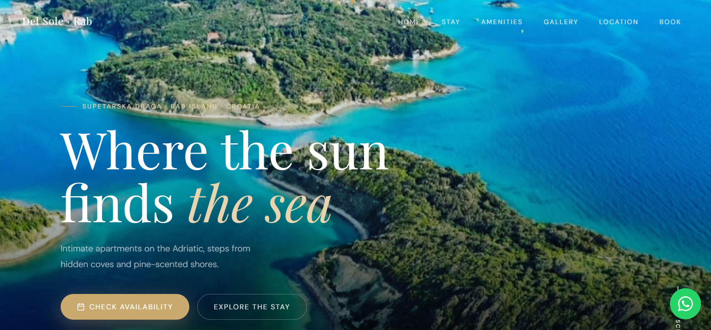
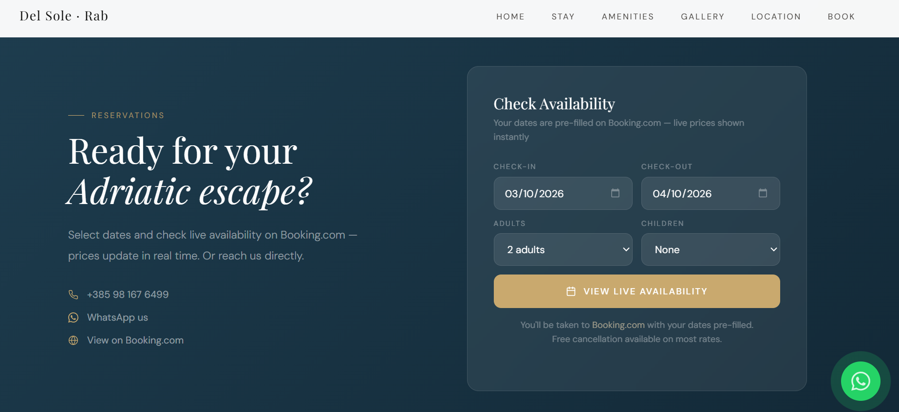
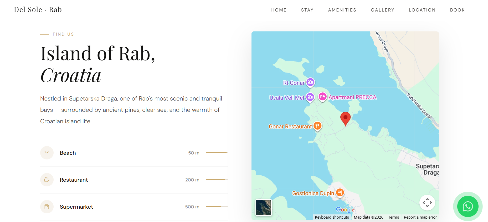
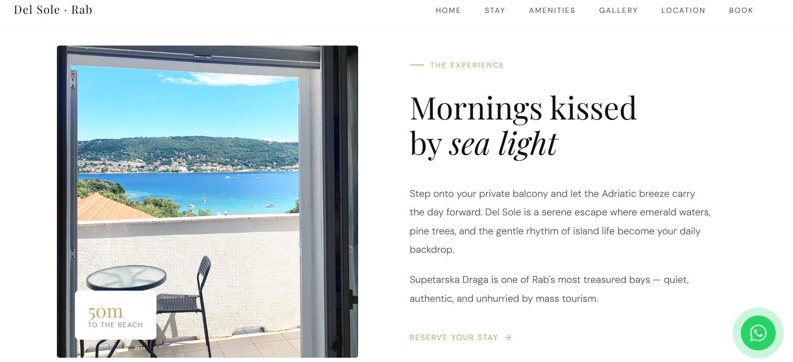

# 🏡 Rab Apartments – Croatia Del Sole

A modern, responsive website created for **Croatia Del Sole**, showcasing holiday apartment accommodation on the island of **Rab, Croatia**.

🌐 **Live Website:**  
https://amberg710.github.io/rab-apartments-croatia-del-sole-/

---
## 📸 Screenshots

<p align="center">
  
  
</p>

<p align="center">
  
  
</p>

## 📖 About the Project

**Rab Apartments – Croatia Del Sole** is a custom-designed accommodation website created to provide visitors with a simple and modern way to explore holiday apartments, view property information, discover the surrounding area, and get in touch for booking enquiries.

The project focuses on:

- Clean and modern visual design
- Responsive layout across desktop, tablet and mobile
- Clear presentation of apartment information
- High-quality imagery
- Easy navigation
- Strong visual focus on the Rab Island holiday experience
- Simple contact and enquiry experience

The website was designed and developed as a standalone web project and is hosted using **GitHub Pages**.

---

## ✨ Features

### 🏠 Apartment Showcase
- Dedicated presentation of the available accommodation
- Apartment information and key features
- Image galleries and visual property presentation
- Clear calls-to-action for enquiries

### 📍 Location & Destination
- Information about the location
- Highlights of Rab Island and the surrounding area
- Visual presentation of the local holiday experience

### 📱 Responsive Design
The website is designed to work across:

- 💻 Desktop
- 💻 Laptop
- 📱 Mobile
- 📲 Tablet

### 🎨 Modern UI
- Clean typography
- Modern spacing and layout
- Image-focused design
- Simple navigation
- Mobile-friendly interface
- Consistent visual styling

---

## 🛠️ Technologies

This project is built using web technologies including:

- HTML5
- CSS3
- JavaScript
- Responsive Web Design
- Git & GitHub
- GitHub Pages

> The project is intentionally lightweight and does not require a traditional backend server for the public website.

---

## 🚀 Live Demo

Visit the live website:

**https://amberg710.github.io/rab-apartments-croatia-del-sole-/**

---

## 📂 Project Structure

```text
rab-apartments-croatia-del-sole-/
│
├── index.html
├── css/
│   └── ...
├── js/
│   └── ...
├── images/
│   └── ...
│
└── README.md
